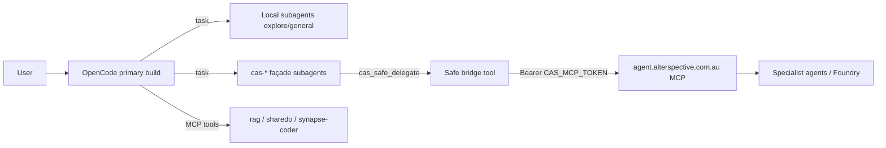

# FEAT-CAS-OPENCODE-BRIDGE — Plan (revised post adversarial review)

**Status:** Implemented (waves 1–3); see [status.md](./status.md) and [INDEX.md](./INDEX.md)  
**Date:** 2026-08-01 (plan); insights 2026-08-02  
**Repos:** `opencode` fork only (prefer `.opencode/` + docs + tests)  
**Adversarial reviewers:** `claude-fable-5`, `openai/gpt-5.6-sol` via Synapse v2  
**AIO product doc:** [KB-AI-036](https://markdown.alterspective.com.au/a/Alterspective-IO/Alterspective-Intelligence/main/Reference/AI/Capabilities/KB-AI-036-OpenCode-Alterspective-Fork-And-CAS-Bridge.md)  

## Goal

Let OpenCode use **specialised CAS agents** (`agent.alterspective.com.au`) as subagent-like capabilities while **code ownership and worktree edits stay local**.

## Problem

- OpenCode subagents are local LLM sessions only.
- CAS already hosts business personas (`cas_delegate`, Agent Foundry) with identity, approvals, and tools.
- No bridge today; routing knowledge lives only in humans.

## Options (summary)

| Option | Approach | Verdict |
|--------|----------|---------|
| A | MCP tools only on primary agent | Too easy to over-expose CAS tools / mis-route data |
| **B-hardened** | MCP + exact tool allowlists + façade subagents + routing plugin + safe delegate tool | **Chosen** |
| C | Patch TaskTool for remote agents | High upstream churn — deferred |

## Adversarial synthesis

| Source | Decision | Must incorporate |
|--------|----------|------------------|
| **gpt-5.6-sol** | NO-GO *as originally stated* | Prompt ≠ enforcement; deny `cas_resolve_tool_call`; no auto history/code egress; verify env/auth; expired-token UX; treat CAS output untrusted; tests beyond prompt injection |
| **claude-fable-5** | GO *conditional* on 4-tool surface | Payload filter/size caps; wrap untrusted CAS output; degraded mode fail-closed (no network if no token, no token in errors) |

### Hardened plan changes (vs original Option B)

1. **Exact allowlist** (not `cas_*`): only `cas_list_agents`, `cas_delegate`, `cas_get_run`, `cas_cancel_run` for façades.
2. **Global deny** for `cas_resolve_tool_call` and `cas_admin_*` (permission rules).
3. **`cas_safe_delegate` tool**: allowlisted `agentId`, task/context size caps, secret/code heuristic reject, then calls CAS MCP via validated path; wraps response in untrusted fence.
4. **Routing plugin** states degraded mode when `CAS_MCP_TOKEN` missing; never claims enforcement is total.
5. **No auto-forward** of conversation history / repo files — façades instruct minimal user-authored task only.
6. **Verification**: unit tests for plugin + safe tool; manual smoke when token present (documented).

## Architecture

## Scope this wave

| In | Out |
|----|-----|
| `.opencode/opencode.jsonc` MCP + permissions | CAS OAuth issuer / refresh fix (CAS repo follow-up) |
| Plugin routing + degraded mode | TaskTool remote transport |
| Façade agents | Deep TUI for CAS run IDs |
| `cas_safe_*` tools | Auto token minting |
| Docs + unit tests | Staging E2E without token |

## Success criteria

1. With no token: OpenCode starts; plugin injects degraded notice; safe tools error without network leak of secrets.
2. With token: façade can list agents and delegate under allowlist + size caps.
3. Permission config denies resolve/admin tools by name pattern.
4. Tests pass for plugin gates and safe-delegate validation.

## Follow-ups

- WAVE-0 CAS: fix `MCP_OAUTH_ISSUER` prod, refresh tokens, optional Keystone-accept for MCP.
- WAVE-2: user confirmation gate UI when plugin API supports it.
- WAVE-3: background poller toast for `cas_start_run` handles.
