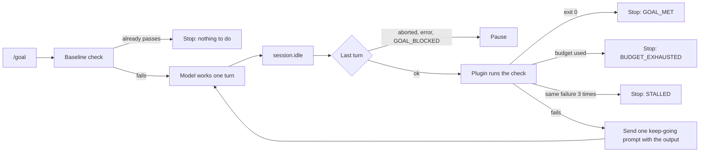

# Goal loop (`/goal`)

Issue: [#84](https://github.com/Alter-Igor/opencode/issues/84). Code: `packages/opencode/src/plugin/goal-loop.ts`. Tests: `packages/opencode/test/plugin/goal-loop.test.ts`.

OpenCode stops after each turn. Claude Code has `/goal` and Codex has a goal mode, but OpenCode had nothing like them. This fork-only plugin keeps a session working until a check command passes.

The plugin does nothing until someone types `/goal`. If your own config already defines a `goal` command, the plugin leaves it alone and stays off.

## Use

```text
/goal <what done looks like> --check "<command that exits 0 when done>" [--turns N] [--minutes N] [--timeout SECONDS] [--record <portable state.json>]
/goal status
/goal stop
/goal resume
```

Defaults: 20 turns, 120 minutes, and a 600 second limit on each check run. `--turns` counts the extra "keep going" prompts the loop sends, not the first turn.

Example:

```text
/goal the parser tests pass --check "bun test test/parser.test.ts" --turns 8
```

## How it works



- The plugin runs the check itself. The model cannot mark the goal met.
- Each keep-going prompt uses the agent and model of the last user message.
- A user abort (Esc), a failed turn, or a reply line `GOAL_BLOCKED: <reason>` pauses the loop. `/goal resume` carries on.
- Durations and timestamps are ignored when comparing failures, so a stall is still caught when only the timing changes.
- A check that runs past `--timeout` is stopped with its whole process tree.
- State lives in `~/.local/state/opencode/goal-loop/<session id>.json`, not in your repository. It survives a restart. Deleting the session deletes it.
- With `--record`, the loop reads the `state` field of an AIMETH-018 portable `state.json` (skill `OPS-004-03`). A terminal state stops the loop, and `PAUSED` pauses it. The check still decides `GOAL_MET`.

## Limits

- `--minutes` is wall-clock time since `/goal`, including time spent paused. A long pause can mean `/goal resume` stops at once with `BUDGET_EXHAUSTED`; start a new `/goal` instead.
- Two OpenCode processes serving the same session (for example the TUI and `opencode serve`) would each send a keep-going prompt. Run the loop from one process.

- The model can still run the check command itself with its shell tool. That is harmless for a normal test command. It matters only for a check that changes state each time it runs.
- The check runs with the same rights as OpenCode. Only the `/goal` command starts a loop or sets its check; the plugin gives the model no tool for it.
- The keep-going prompt tells the model not to edit the check or its tests. The plugin does not enforce that.

## Live check (2026-10-03)

OpenCode `1.18.31` from this branch, `opencode serve`, model `synapse/auto`, a scratch repository with three failing tests in `sum.test.ts`.

| Scenario | Session | Result |
|---|---|---|
| Fix failing tests | `ses_efe7fc78cffef75a30Ca8VJ7bL` | Baseline `bun test` failed (0 pass, 3 fail). The model fixed `sum.ts` in one turn. The plugin ran `bun test`: exit 0, loop stopped `GOAL_MET`. |
| Impossible check | `ses_efe7ec27effejfk02dnfBT9WYO` | The check always exits 1. The model replied `GOAL_BLOCKED: ...`. The loop paused and posted the reason. |
| Keep going | `ses_efe738172ffeeGKKRsZKjcRtNI` | A gate that passes on its 3rd run. Run 2 failed, the plugin sent one keep-going prompt (agent `build`, model `auto`), the model worked again, run 3 passed: `GOAL_MET after 1 extra prompt(s)`. |
| Budget | `ses_efe716e08ffeA3FK61ldr7M2GI` | `--turns 1` with a gate that needs 9 runs. One keep-going prompt, then `BUDGET_EXHAUSTED: used all 1 turns`. The gate counter read 4, not 3: the transcript shows the model ran the gate once itself with its shell tool. |

Not checked live: the TUI toast, `/goal stop` while a check is running (unit test only), and `--record`.
