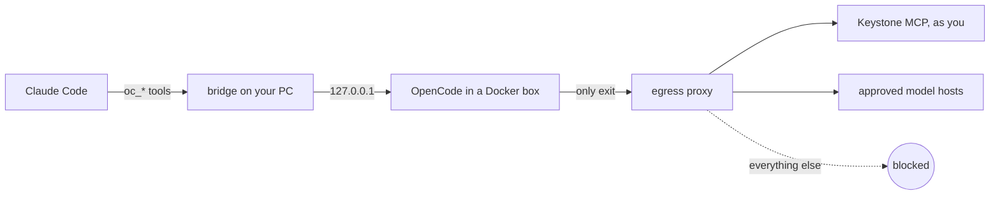

# FEAT-OCD-001: OpenCode delegate MCP bridge

**Feature ID:** FEAT-OCD-001 · **Issue:** [#41 — local OpenCode MCP bridge for delegated sessions](https://github.com/Alter-Igor/opencode/issues/41)
**Status:** Approved 2026-10-01 (D-A box, Q1 approve, Q2 Keystone + Synapse + npm + PyPI, Q3 patch). Execution: Wave 0.
**Created:** 2026-09-30 · **Owner:** Igor Jericevich
**Branch / worktree:** `opencode-mcp-bridge` · `C:\GitHub\opencode---opencode-mcp-bridge`

## What it does

Claude Code (and later Codex or Gemini) gets a set of tools called `oc_*`. With them it can:

- start an OpenCode session in a repo, and pick the model
- give it a task, check on it, and be told when it finishes or needs an answer
- answer its permission questions
- run many sessions at once
- let the agents send each other messages

Delegated sessions may use **only** Keystone MCP services, signed in as you.

## How it works

**Why a box?** The review found that an agent's shell runs as you. On your own account it could read your ~20 saved API keys and your saved logins. Only a sandbox makes "Keystone only" true, even for an agent that misbehaves. Details: `evidence/adversarial-review.md`.

## Owner decisions (answered 2026-10-01: D-A **box**, Q1 **approve**, Q2 **npm + PyPI**, Q3 **allow**)

| # | Decision | Options | My pick |
|---|---|---|---|
| **D-A** | Where OpenCode runs | **A-S Docker box**: truly Keystone-only; slower file access; Windows-only repos can't be built. **A-U your own account**: fast; Keystone-only holds only for OpenCode's MCP client, not for its shell. | **A-S** |
| Q1 | Local-only transport (BFA-003 needs a recorded exception) | Approve the exception for a local developer tool, or wait for a hosted version | Approve |
| Q2 | Internet for agents beyond Keystone + model hosts | None, or add package registries (npm, PyPI) so installs work | Add npm + PyPI only |
| Q3 | Small fork patch in `packages/opencode/src/mcp/` (MCP allowlist, URLs in `GET /mcp`, one-at-a-time token refresh) | Allow it (≤150 LOC, env-gated, tested), or no source changes | Allow |

## Build order

| Wave | What | Proof |
|---|---|---|
| W0 | Spikes: box + egress, token race, Keystone sign-in from the box, fork patch | Refused `curl` to a direct endpoint; `ks-delegate: connected` |
| W1 | Supervisor + policy guard | Red→green guard tests |
| W2 | Event hub + watch CLI + inbox sidecar | Monitor lines arrive; loops stop at 3 hops |
| W3 | MCP tools + wiring + E2E | 2 sessions, 2 repos, 2 models, live events |

Kill criteria stop the work and come back to you (`plan.md` §5).

## Files

`plan.md` (sections 1–12) · `technical-design.md` · `requirements.md` · `acceptance-criteria.md` · `impact-analysis.md` · `module-register.md` · `checklist.md` · `issues.md` · `status.md` · `evidence/` · `modules/`
