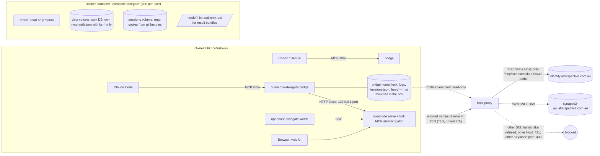

# FEAT-OCD-001 — Technical design (revision 5: chosen Keystone services after review round 4; revision 4: front proxy after round 3; revision 3 after round 2 and Wave 0 spikes)

No implementation code here — contracts, data shapes and behaviour only. Paths are relative to the repo root. Revision 2 changes are driven by `evidence/adversarial-review.md` (C1, C2, H1–H4, M1–M6).

## 0. The key fact that shaped revision 2

A delegated agent has a shell. On a same-user design that shell can read everything the owner can: ~20 shared API keys in `HKCU\Environment`, the owner's `mcp-auth.json` tokens, and the server password (review C1, C2). So "only Keystone MCP" can be **enforced** only if the agent runs somewhere those things are not. Two isolation levels:

| Level | Where OpenCode runs | Enforces R7 against | Status |
|---|---|---|---|
| **S — Sandbox (default)** | Docker container, own data volume, no host secrets, egress allowlist | a mistaken **or** misbehaving agent | Recommended (decision D-A) |
| U — Same user (fallback) | Host process with an isolated profile | a mistaken agent only (OpenCode's MCP client). **Does not** stop a misbehaving shell. | Only if the owner declines Docker; labelled as best-effort |

Everything below describes Level S; Level U differences are marked **[U]**.

## 1. Architecture

**Boundaries.**
- The bridge never holds Keystone tokens. OpenCode's MCP client (inside the box) does OAuth 2.1 + PKCE with Keystone and stores tokens in the box's own data volume, keyed by entry name (`packages/opencode/src/mcp/auth.ts:9-37`). Those tokens only work at the Keystone relay (RFC 8707 audience binding), so even if the agent reads them, use still goes through Keystone, as the owner, audited (BFA-007).
- The container has **no** host environment, no `HKCU` secrets, no `~/.config/opencode`, no owner `mcp-auth.json`, no `%ProgramData%\opencode`. Config sources outside the profile (review H4) do not exist inside the box by construction.
- Network: the container joins an internal Docker network with no default route. Its only way out is the `front` proxy (revision 4, review R3-01). Inside the box, each allowed name (`identity.alterspective.com.au`, the approved model host) is a network alias of `front`. `front` ends TLS with a leaf from a private CA made inside it (key never leaves its volume; name-constrained to the allowed hosts) and opens its own TLS connection to the one real host, with SNI and `Host` fixed and the upstream certificate verified. An unknown SNI is refused at the handshake and a `Host` that does not match gets `421`. There is no CONNECT proxy: a host-name CONNECT allowlist was not enough, because the box owned the TLS session and could swap SNI or `Host` to reach other sites on the same Cloudflare / Azure front door. Upstream names are looked up with `OCD_FRONT_RESOLVER` (public DNS by default; fails closed). This is the control that makes R7 hold even if the agent learns the server password (C2).
- Keystone paths (revision 5, review R4-01). Reaching Keystone is not enough: `/mcp/dynamic` relays to every service on the owner's account (mail, remote code). On the Keystone host, `front` forwards only `/mcp/c/<id>` for each **chosen** connection, that connection's `/.well-known/oauth-protected-resource/mcp/c/<id>`, and the OAuth paths the MCP client calls (`/.well-known/oauth-authorization-server`, `/.well-known/openid-configuration`, `/api/oauth/register`, `/api/oidc/token`). Every other path gets `403` from `front` and never reaches Keystone. Each path is an exact `location =` match on nginx's normalised URI, and each forwards its own **literal** path, with no query string, so no spelling (`..`, `%2F`, `//`, `;`, case) can reach another path. The chosen set is picked at runtime (`oc_server_restart {keystone}`, default `rag-read`, `github`, `seqlogs` since issue #56; `rag-read` is the owner's private read-only connection, and others set their own id) and saved in the bridge home. The bridge writes `front`'s servers file there and mounts it read-only; its hash is a `front` label, so a `front` with another set is never reused. What the chosen services can do still leaves the box, for example a GitHub write: choose the set for the job.

**Location.** `alterspective/delegate-mcp/` (bridge, watch CLI, profile template, `Dockerfile`, compose file). Outside the Bun workspace globs (`package.json:25-32`) with its own lockfile. The image builds the fork from this checkout, so the patch in §3.4 ships with it.

## 2. Components

| Module | Responsibility |
|---|---|
| MOD-01 server-supervisor | Build profile; build/pull image; start or reuse the container; generate the server password (bridge memory + container env only); health check; stop; `oc_login` |
| MOD-02 policy-guard | Allowlist validator; runtime checks (`GET /mcp` with URL/type from the patch; `session.permission` re-read); egress allowlist file; one-busy-session-per-folder |
| MOD-03 event-hub | One `/global/event` stream per bridge; state machine; cursor buffer; reconnect + rebuild; watch CLI; optional channel push |
| MOD-04 tool-surface | MCP tools, schemas, size caps, untrusted fencing, error mapping |
| MOD-05 agent-inbox | Inbox in the bridge dir (not mounted); in-box tools post via a tiny inbox endpoint the bridge exposes to the container only |
| Hub | Contracts, wiring, fork patch (§3.4), versioning, docs, E2E |

## 3. Keystone-only enforcement

### 3.1 Profile (read-only mount at the container's global config dir)
- `provider`, `model`, `small_model` copied from the owner's global config **only** if values are `{env:…}` references; the referenced variables are passed into the container **one by one** from an owner-approved list (e.g. the Synapse gateway key). Literal secrets → `profile_invalid`.
- `mcp`: one `ks-<id>` entry per chosen Keystone connection, allowlisted (§3.2). `permission`: baseline (§3.3). `instructions`: set per session by the bridge to the repo's `AGENTS.md`/`CLAUDE.md` (review M4).
- Whole profile directory hashed; mounted read-only (review M2).

### 3.2 Allowlist rule (fails closed)
Allowed only if **all** hold: `type:"remote"`; URL origin exactly `https://identity.alterspective.com.au`; name `ks-<id>` and path exactly `/mcp/c/<id>`, with `<id>` (`^[a-z0-9][a-z0-9-]{0,62}$`) in the chosen Keystone set (revision 5, R4-01: no `/mcp/dynamic`); the fork patch policy is `^/mcp/c/(<id1>|<id2>|...)$` with the ids regex-escaped; no `headers` (a static header means a shared key — BFA-007; it does not disable OAuth, review row 28); `oauth` is absent or contains only `scope` and/or `clientId` (strings); no `clientSecret`, `redirectUri`, `callbackPort` (review M6); only the keys `type`, `url`, `oauth`, `enabled`, `timeout` are accepted; an `enabled:false` entry is still validated. Entries: `ks-<id>` → `/mcp/c/<id>` for each chosen id; default set `rag-read`, `github`, `seqlogs` (issue #56; was `rag-global`). These checks catch setup mistakes; the wall is `front` (§1).

### 3.3 Permission baseline (convenience, not the security boundary)
In the profile config **and** on each session (`session/session.ts:260-270`): `* allow`, `external_directory deny`, `webfetch ask`, `bash ask` for push/merge/destructive patterns, `doom_loop ask`, `ks-*_* allow`. A session started with `keystone: [...]` (a subset of the box-wide set) also gets `ks-*_* deny` and `read mcp:ks-*:* deny`, then `ks-<id>_*` and `read mcp:ks-<id>:*` back for the named ids. That narrowing is a convenience: in-box code can still use every connection of the box-wide set. The `readonly` profile adds `edit deny`, `bash ask` for everything, and ends with `ks-*_* ask` so Keystone tools that can write need an answer (review A-16). Pattern asks are bypassable (review G1) and subagents drop `ask` rules (`agent/subagent-permissions.ts:20-23`), so **no R7 claim rests on them**. The bridge never sends the deprecated `tools` field (`session/prompt.ts:1060-1066`), and re-reads `session.permission` before each send (H3). `always` replies are refused by the bridge.

### 3.4 Fork patch (defence in depth; review H1, H2)
Small, test-covered change in `packages/opencode/src/mcp/`:
1. `OPENCODE_MCP_ALLOW` (JSON: allowed origins + path regex). When set, `MCP.create`/`MCP.add` refuse any config that fails it, with status `failed: policy`. Unset ⇒ upstream behaviour unchanged.
2. ~~`GET /mcp` includes `type` and `url`~~ — dropped: the patch refuses a bad entry at `create`/`startAuth`, so anything listed has already passed the URL check; the bridge still checks names are `ks-*`. (`oauth` may carry `scope` and `clientId` only.)
3. Single-flight token refresh per entry name inside one process (`mcp/oauth-provider.ts`), so N directory instances never race one Keystone token family.
Recorded in the fork notes of `AGENTS.md` with the regression test to run after every upstream sync. Kill criterion: if the patch cannot stay under ~150 LOC in these files, stop and report.

### 3.5 Runtime guard (bridge)
Before each `oc_send`: `GET /mcp?directory=<session dir>` → every entry name must be `ks-<id>` for a chosen id (the fork patch has already refused any entry whose URL fails §3.2, so names are enough **only while the patch is active**); read failure → `policy_unverified`. The supervisor therefore also verifies, on start and reuse, that the box runs the expected image and that its `OPENCODE_MCP_ALLOW` equals the bridge's policy; a mismatch is `profile_changed` (review A-04/A-05). Always sends `directory` (review M5). Also polls `GET /mcp` for busy directories every 15 s (no event exists for `MCP.add`, review row 22) and aborts on violation.

## 4. Container lifecycle (MOD-01)

- Image: built from this checkout (fork + patch), plugin deps pre-installed (review L5), `git`, `bun`, `node`, common toolchains. Tag = package version + git SHA.
- One container per user, name `opencode-delegate`. Mounts: profile → global config dir (ro, ships a `.gitignore` so OpenCode never writes there — spike T0.1), named volume → data dir, named volume → `/sessions` (session clones), host hand-off folders → `/handoff/in` (**read-only** in the box; the host writes fresh, exclusively-created bundle names) and `/handoff/out`, which is the box-only Docker volume `handoff-out`, not a host folder (issue #54, G-7): the box writes its bundle there, and the bridge takes it out with `docker cp <box>:<path> -`, the checked tar stream (`src/supervisor/workspaces-copyout.ts`: `stat` in the box says one regular file within the size cap; the stream holds exactly one regular-file entry, no link or folder, within the cap; then a host-only quarantine file of exactly that size) (review C-4). **The owner's repos are never mounted** (review N2; bind mounts measured at ~2–4 ms per file and git refuses them — `evidence/wave0-spikes.md`).
- Env: `XDG_CONFIG_HOME`, `XDG_DATA_HOME`, `NODE_EXTRA_CA_CERTS` (the front CA, public cert only), `OPENCODE_DISABLE_MODELS_FETCH=1`, `OPENCODE_DISABLE_AUTOUPDATE=1`, `OPENCODE_MCP_ALLOW`, `OPENCODE_SERVER_PASSWORD`. No Synapse credential (issue #48): the box holds no model key; `front` adds the owner's delegated Synapse token (kept and renewed on the host, in front's read-only include) to the model routes only. Nothing else from the host.
- Filesystem read-only except tmpfs `/tmp`, `/home/agent` and the volumes; server runs as non-root `agent` (uid 10001); OpenCode install owned by root (review N1).
- Password: 24 random bytes (base64url) generated by the first bridge, passed as container env, kept in bridge memory. Other bridges and the watch CLI get it from the container (`docker inspect` needs the owner's Docker access, not a file the agent can read). **[U]**: lock file in the owner's profile + `OPENCODE_DB=opencode-delegate.db` + explicit env allowlist.
- Port: container publishes `127.0.0.1:<random>` only.
- Keystone sign-in (`oc_login`), **proven in T0.3**: `POST /mcp/ks-<id>/auth` → authorization URL + `oauthState`; the bridge opens the owner's browser only for an S256 PKCE code request to Keystone's authorize path, back to its loopback listener, whose `resource` is that entry's own `/mcp/c/<id>` (revision 5); it listens on host `127.0.0.1:19876` for the loopback redirect, checks `state`, then relays only the `code` to `POST /mcp/ks-<id>/auth/callback`. With no `server`, `oc_login` signs in every chosen entry that is `needs_auth`, one at a time, and stops at the first that does not finish. A clash with the owner's TUI sign-in on 19876 is possible but short-lived (review L3): the bridge reports `port_busy` and retries.
- Workspaces (replaces path translation): `oc_start_session {directory}` → the bridge runs `git bundle create <handoff>/in/<fresh>.bundle --all` in the owner's repo (no hooks run) → the box clones it (`--no-checkout`) into a temp folder, checks out `delegate/<session>` at the recorded base and moves it to `/sessions/<session>`; an existing folder → `directory_busy`. `oc_result`/`oc_collect` → the box writes `/handoff/out/<fresh>.bundle` on a box-only Docker volume (no host folder, issue #54); the bridge takes it out with `docker cp` and runs `git fetch <bundle> delegate/<session>:delegate/<session>` in the owner's repo (no hooks from the bundle run). The owner reviews that branch like any PR. Repos must be under `C:\GitHub` (`X:` subst normalised); anything else → `directory_invalid`.
- Package installs: the box reaches npm and PyPI only through read-only pull-through caches on the internal network (publish disabled; review N3). Built in Wave 1.
- Stop: `docker compose -p opencode-delegate down` (volumes kept) when the last bridge lease ends, run under the start lock so a starting bridge cannot be stopped mid-start (review A-02). No process-class kills (AILES-026).

## 5. Tool contracts (MOD-04)

All tools: zod-validated input; short JSON + one-line summary; session text wrapped in an `untrusted` field; errors `{code, message, action}` (ERR-SPLIT-01, ERR-MSG-03); default cap ~8k tokens with paging.

| Tool | Input | Result |
|---|---|---|
| `oc_doctor` | — | container state, image version/SHA, isolation level (S/U), the chosen Keystone set (saved or default) with each `ks-<id>` auth state, egress check (front config for that set, read-only mount), `frontMatches`, guard verdict |
| `oc_login` | `server?` (default: every chosen `ks-<id>` that is `needs_auth`) | `needs_auth` → browser → `connected` / `failed` |
| `oc_list_models` | `provider?` | `providerID/modelID` list, plus `keystone` (the box-wide set) |
| `oc_start_session` | `directory`, `title?`, `agent?`, `model?`, `profile?` (`standard`/`readonly`), `allowShared?`, `keystone?` (subset of the box-wide set; convenience only) | `sessionID`, `webUrl` (never contains the password, L6) |
| `oc_send` | `sessionID`, `message`, `model?`, `agent?`, `correlationId?` | `accepted` \| `not_started` \| `refused(policy_*)` |
| `oc_status` | `sessionID?` | state (§6), since, todos, tokens, last error |
| `oc_wait` | `sessionIDs[]`, `until[]`, `timeoutSec` ≤240, `cursor?` | events + cursor, or `still_running` |
| `oc_events` | `cursor`, `sessionID?`, `limit` ≤200 | page of events |
| `oc_result` | `sessionID`, `messages?` | last assistant text (untrusted), diff summary, todos |
| `oc_pending` | `sessionID?` | pending permissions + questions with IDs |
| `oc_answer` | `requestID`, `kind`, `reply` (`once`/`reject`+`message?`) or `answers[][]` | `ok` (`always` refused) |
| `oc_abort` | `sessionID` | `ok` |
| `oc_list_sessions` | `directory?`, `mine?` | sessions + supervisor + state; `prunedRecords` when it removed this box's host records of sessions proved gone (#53), so it is marked destructive |
| `oc_post` / `oc_inbox` | `to`, `text`, `wake?` / `cursor?` | agent inbox (§7) |
| `oc_server_restart` | `confirm`, `force?`, `keystone?` (new box-wide set, saved) | restarted, interrupted bridges, the set it runs with |

Optional Claude channel push as in revision 1 (off by default).

## 6. Session state machine and absent states (MOD-03)

Unchanged from revision 1: `starting`, `busy`, `retry`, `needs_input`, `idle`, `error`, `aborted`, `not_started`, `unknown(stream_gap)`, `not_found`, `server_down`, `policy_unverified`. Idle sessions are absent from `GET /session/status` (`session/status.ts:42-46`) ⇒ resolve via `GET /session/:id`. Reconnect rebuilds from `/session/status`, `/permission`, `/question`; no replay exists. `prompt_async` 204 without `busy` in 10 s ⇒ `not_started` (anomalyco/opencode#26635).

## 7. Agent inbox (MOD-05) — as built (Wave 2)

- **Sidecar** `inbox` (Bun HTTP, image `${OCD_IMAGE}-inbox`, own named volume, hardened like the other siblings). On `sealed` for the box and on `outside` only because Docker will not publish a port from an internal-only container; its admin port is published to host `127.0.0.1` only.
- **Honest trust model.** Inside the box any code can claim to be any session, so box-side posts (`POST /v1/post`, no token) are stored `verified:false` with the *claimed* `session:<id>` sender; a box-side `supervisor:` sender is refused (403) and the box cannot read supervisor inboxes. Only bridges hold the admin token (generated per box start, kept in bridge memory and in the sidecar's env only — never in the box's env or any file), so admin posts (`POST /v1/admin/post`, Bearer, constant-time compare) are `verified:true` as `supervisor:<name>`. Any in-box code can read any session's inbox: this is one owner's own agents, and it is documented, not hidden.
- **Limits enforced by the sidecar:** text ≤ 8 KB (413), 10/min per claimed sender and 60/min across the box route (429), hop limit 3 counted per thread (`correlationId`) by the sidecar itself, append-only JSONL (fsync; rotate at 10 MB; keep 5 files); no edit/delete route. Logs never contain message text.
- **In-box tools** (`message_supervisor`, `message_session`, `read_inbox`, shipped in the read-only profile `tool/` dir and covered by the profile hash): the supervisor address comes from the session's `metadata.supervisor` (set by the bridge on `POST /session`; subagents inherit it); returned text is labelled "AI-written, unverified sender" (ETHICS-AGENT-03). Tools never wake anyone.
- **Bridge client** (`src/inbox/`): unreachable/timeout/5xx → `inbox_unavailable` (a failed read is never "no messages"); 429 → `inbox_limited`; `wakeText()` frames a message as untrusted input when `oc_post` uses `wake:true` (the bridge is the only thing that wakes a session).

## 8. Errors, logging, versioning

As revision 1: stable error codes (`server_down`, `profile_invalid`, `profile_changed`, `policy_violation`, `policy_unverified`, `needs_auth`, `directory_invalid`, `directory_busy`, `not_found`, `not_started`, `cursor_expired`, `inbox_unavailable`, `upstream_error`, `sandbox_unavailable`); JSON logs to stderr + file (D-1, OBS-SNK-01 deviation); audit line per tool call; `correlationId` in session metadata and `X-Correlation-ID`; version in `alterspective/delegate-mcp/package.json`, `-dev+<sha>` locally, image tag includes SHA.

## 9. Compliance design matrix

| Concern | Applicable? | Planned approach | Rule IDs | Verification |
|---|---|---|---|---|
| Keystone-only MCP | YES | Front proxy (fixed upstreams) + fork allowlist patch + bridge guard, all fail closed | BFA-007, MCP-CONSUME-01 | T0.1, T2.x red→green; F5 runtime incl. `curl` to a direct endpoint from an agent shell → refused |
| Per-user OAuth | YES | OpenCode MCP OAuth in the box; tokens in box volume only | BFA-004, BFA-005 | T0.3 + F6 audit |
| stdio transport | YES | Local-only; exclusion recorded after approval | BFA-003 | Q1 |
| Secrets | YES | No host secrets in the box; approved env vars passed one by one; password in memory/env only | ASR-04, SEC-CRED-CLI-01 | secret scan inside the box (`env`, files) |
| Input validation | YES | zod; path translation; allowlist regex | SECURITY :517 | unit tests |
| Fail closed | YES | Front: unknown SNI refused, wrong `Host` 421, no other names resolve; guard refuses unverified | SECURITY :832 | red tests |
| Sensitive actions | YES | `always` refused; asks as convenience | MCP-STANDARDS :707, ETHICS-AGENT-02 | T4.4 |
| Untrusted output | YES | Fencing; request IDs from `oc_pending` only | ETHICS-AGENT-01 | T4.5 |
| Errors | YES | Stable codes, split texts | ERR-SPLIT-01, ERR-MSG-03, ERR-ENF-01 | unit |
| Logging/tracing | YES | stderr + file; correlationId | OBS-SNK-01 (D-1), OBS-ID-01/04, OBS-AI-02 | log test |
| Testing | YES | ≥90% new code; red-first guards; fork patch regression test | TST-VAL-01/07, TST-FAL-01/02 | coverage |
| Versioning | YES | package + image SHA | VER-SRC-01/02, VER-BUILD-02, VER-DEV-01, VER-LOG-01 (G-2) | `--version --json` |
| Architecture | YES | Docker base image + proxy image assessed | ARCH-ASSESS-01 | assessment note in `evidence/` |
| Documentation | YES | Pack + fork notes | DOC-MOD-01..04, DOC-HF-04 | review |
| Work tracking | YES | #41 checkpoints | WT-PM-01..11 | issue history |
| Realtime (browser) | NO | Not a browser surface | — | — |
| Accessibility | NO | No UI of ours | — | — |
| Analytics/privacy | NO | No analytics; Keystone audit + local log | — | — |
| Performance | NO (no binding rule) | Targets in plan §9; bind-mount speed measured in T0.1 | — | timing |
| Langfuse | NO (indirect) | Bridge makes no LLM calls | OBS-AI-02 | metadata test |

## 10. Edge cases

1. Two bridges start at once → a start lock file (`<home>/start.lock`, owner PID + heartbeat) serialises `compose up`; the loser waits and reuses (review A-01).
2. Container crash → `server_down`, restart, sessions `unknown` until rebuilt; history persists in the volume.
3. Provider config uses a literal key → `profile_invalid` naming the key path, value never copied.
4. A `ks-<id>` entry needs sign-in mid-task → task continues without MCP tools; `oc_status` shows `needs_auth`.
5. Keystone `relay_error` → reported; retry advice 30–90 s (AILES-043).
6. Repo path on `X:` (subst of `C:\GitHub`) → normalised before translation.
7. Two sessions, one folder → `directory_busy` unless `allowShared`.
8. Unknown model → refused with the model list.
9. Oversized output → truncated + page cursor.
10. Inbox ping-pong → hop + rate limits at the bridge.
11. Docker Desktop not running → `sandbox_unavailable`; **no silent fallback to Level U**.
12. Agent needs npm/pip/bun/uv packages → served by the read-only caches on the internal network; the box never reaches a public registry directly and cannot publish (Q2, review N3).
