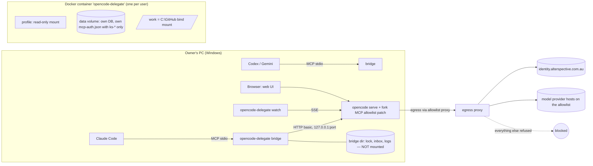

# FEAT-OCD-001 — Technical design (revision 2, after adversarial review round 1)

No implementation code here — contracts, data shapes and behaviour only. Paths are relative to the repo root. Revision 2 changes are driven by `evidence/adversarial-review.md` (C1, C2, H1–H4, M1–M6).

## 0. The key fact that shaped revision 2

A delegated agent has a shell. On a same-user design that shell can read everything the owner can: ~20 shared API keys in `HKCU\Environment`, the owner's `mcp-auth.json` tokens, and the server password (review C1, C2). So "only Keystone MCP" can be **enforced** only if the agent runs somewhere those things are not. Two isolation levels:

| Level | Where OpenCode runs | Enforces R7 against | Status |
|---|---|---|---|
| **S — Sandbox (default)** | Docker container, own data volume, no host secrets, egress allowlist | a mistaken **or** misbehaving agent | Recommended (decision D-A) |
| U — Same user (fallback) | Host process with an isolated profile | a mistaken agent only (OpenCode's MCP client). **Does not** stop a misbehaving shell. | Only if the owner declines Docker; labelled as best-effort |

Everything below describes Level S; Level U differences are marked **[U]**.

## 1. Architecture

**Boundaries.**
- The bridge never holds Keystone tokens. OpenCode's MCP client (inside the box) does OAuth 2.1 + PKCE with Keystone and stores tokens in the box's own data volume, keyed by entry name (`packages/opencode/src/mcp/auth.ts:9-37`). Those tokens only work at the Keystone relay (RFC 8707 audience binding), so even if the agent reads them, use still goes through Keystone, as the owner, audited (BFA-007).
- The container has **no** host environment, no `HKCU` secrets, no `~/.config/opencode`, no owner `mcp-auth.json`, no `%ProgramData%\opencode`. Config sources outside the profile (review H4) do not exist inside the box by construction.
- Network: the container joins an internal Docker network with no default route; its only way out is an egress proxy that allows `identity.alterspective.com.au:443` plus the model hosts on the owner-approved list. Everything else is refused (fails closed). This is the control that makes R7 hold even if the agent learns the server password (C2).

**Location.** `alterspective/delegate-mcp/` (bridge, watch CLI, profile template, `Dockerfile`, compose file). Outside the Bun workspace globs (`package.json:25-32`) with its own lockfile. The image builds the fork from this checkout, so the patch in §3.4 ships with it.

## 2. Components

| Module | Responsibility |
|---|---|
| MOD-01 server-supervisor | Build profile; build/pull image; start or reuse the container; generate the server password (bridge memory + container env only); health check; stop; `oc_login` |
| MOD-02 policy-guard | Allowlist validator; runtime checks (`GET /mcp` with URL/type from the patch; `session.permission` re-read); egress allowlist file; one-busy-session-per-folder |
| MOD-03 event-hub | One `/global/event` stream per bridge; state machine; cursor buffer; reconnect + rebuild; watch CLI; optional channel push |
| MOD-04 tool-surface | MCP tools, schemas, size caps, untrusted fencing, error mapping |
| MOD-05 agent-inbox | Inbox in the bridge dir (not mounted); in-box tools post via a tiny inbox endpoint the bridge exposes to the container only |
| Hub | Contracts, wiring, fork patch (§3.4), versioning, docs, E2E |

## 3. Keystone-only enforcement

### 3.1 Profile (read-only mount at the container's global config dir)
- `provider`, `model`, `small_model` copied from the owner's global config **only** if values are `{env:…}` references; the referenced variables are passed into the container **one by one** from an owner-approved list (e.g. the Synapse gateway key). Literal secrets → `profile_invalid`.
- `mcp`: allowlisted entries only (§3.2). `permission`: baseline (§3.3). `instructions`: set per session by the bridge to the repo's `AGENTS.md`/`CLAUDE.md` (review M4).
- Whole profile directory hashed; mounted read-only (review M2).

### 3.2 Allowlist rule (fails closed)
Allowed only if **all** hold: `type:"remote"`; URL origin exactly `https://identity.alterspective.com.au`; path `^/mcp/(dynamic|c/[A-Za-z0-9_-]+)$`; no `headers` (a static header means a shared key — BFA-007; it does not disable OAuth, review row 28); `oauth` is absent or contains only `scope`; no `clientSecret`, `redirectUri`, `callbackPort` (review M6); name starts `ks-`. Default: `ks-delegate` → `/mcp/dynamic`; pinned: `ks-<connectionId>` → `/mcp/c/<connectionId>`.

### 3.3 Permission baseline (convenience, not the security boundary)
In the profile config **and** on each session (`session/session.ts:260-270`): `* allow`, `external_directory deny`, `webfetch ask`, `bash ask` for push/merge/destructive patterns, `doom_loop ask`, `ks-*_* allow`. Pattern asks are bypassable (review G1) and subagents drop `ask` rules (`agent/subagent-permissions.ts:20-23`), so **no R7 claim rests on them**. The bridge never sends the deprecated `tools` field (`session/prompt.ts:1060-1066`), and re-reads `session.permission` before each send (H3). `always` replies are refused by the bridge.

### 3.4 Fork patch (defence in depth; review H1, H2)
Small, test-covered change in `packages/opencode/src/mcp/`:
1. `OPENCODE_MCP_ALLOW` (JSON: allowed origins + path regex). When set, `MCP.create`/`MCP.add` refuse any config that fails it, with status `failed: policy`. Unset ⇒ upstream behaviour unchanged.
2. `GET /mcp` includes `type` and `url` (remote) per entry, so the bridge guard can verify, not guess.
3. Single-flight token refresh per entry name inside one process (`mcp/oauth-provider.ts`), so N directory instances never race one Keystone token family.
Recorded in the fork notes of `AGENTS.md` with the regression test to run after every upstream sync. Kill criterion: if the patch cannot stay under ~150 LOC in these files, stop and report.

### 3.5 Runtime guard (bridge)
Before each `oc_send`: `GET /mcp?directory=<session dir>` → every entry must pass §3.2 **by URL/type**; read failure → `policy_unverified`. Always sends `directory` (review M5). Also polls `GET /mcp` for busy directories every 15 s (no event exists for `MCP.add`, review row 22) and aborts on violation.

## 4. Container lifecycle (MOD-01)

- Image: built from this checkout (fork + patch), plugin deps pre-installed (review L5), `git`, `bun`, `node`, common toolchains. Tag = package version + git SHA.
- One container per user, name `opencode-delegate`. Mounts: `C:\GitHub` → `/work` (rw), profile → global config dir (ro), named volume → data dir. No other host paths.
- Password: 32 random bytes generated by the first bridge, passed as container env, kept in bridge memory. Other bridges and the watch CLI get it from the container (`docker inspect` needs the owner's Docker access, not a file the agent can read). **[U]**: lock file in the owner's profile + `OPENCODE_DB=opencode-delegate.db` + explicit env allowlist.
- Port: container publishes `127.0.0.1:<random>` only.
- Keystone sign-in (`oc_login`): `POST /mcp/ks-delegate/auth` returns the authorization URL; the bridge opens it in the owner's browser; the callback port for `ks-delegate` (not 19876, review L3) is published to `127.0.0.1` on the host; the in-box callback listener must bind `0.0.0.0` inside the box — **spike T0.3**; fallback: bridge relays `code` to `POST /mcp/:name/auth/callback` (`mcp/index.ts:913-937`).
- Paths: repo paths are translated host `C:\GitHub\x` (and `X:\x`) ⇄ `/work/x`; anything outside `C:\GitHub` → `directory_invalid`.
- Stop: `docker stop opencode-delegate` when the last bridge lease ends (no process-class kills, AILES-026).

## 5. Tool contracts (MOD-04)

All tools: zod-validated input; short JSON + one-line summary; session text wrapped in an `untrusted` field; errors `{code, message, action}` (ERR-SPLIT-01, ERR-MSG-03); default cap ~8k tokens with paging.

| Tool | Input | Result |
|---|---|---|
| `oc_doctor` | — | container state, image version/SHA, isolation level (S/U), profile MCP list with URLs, `ks-*` auth states, egress allowlist, guard verdict |
| `oc_login` | `server?` (default `ks-delegate`) | `needs_auth` → browser → `connected` / `failed` |
| `oc_list_models` | `provider?` | `providerID/modelID` list |
| `oc_start_session` | `directory`, `title?`, `agent?`, `model?`, `profile?` (`standard`/`readonly`), `allowShared?` | `sessionID`, `webUrl` (never contains the password, L6) |
| `oc_send` | `sessionID`, `message`, `model?`, `agent?`, `correlationId?` | `accepted` \| `not_started` \| `refused(policy_*)` |
| `oc_status` | `sessionID?` | state (§6), since, todos, tokens, last error |
| `oc_wait` | `sessionIDs[]`, `until[]`, `timeoutSec` ≤240, `cursor?` | events + cursor, or `still_running` |
| `oc_events` | `cursor`, `sessionID?`, `limit` ≤200 | page of events |
| `oc_result` | `sessionID`, `messages?` | last assistant text (untrusted), diff summary, todos |
| `oc_pending` | `sessionID?` | pending permissions + questions with IDs |
| `oc_answer` | `requestID`, `kind`, `reply` (`once`/`reject`+`message?`) or `answers[][]` | `ok` (`always` refused) |
| `oc_abort` | `sessionID` | `ok` |
| `oc_list_sessions` | `directory?`, `mine?` | sessions + supervisor + state |
| `oc_post` / `oc_inbox` | `to`, `text`, `wake?` / `cursor?` | agent inbox (§7) |

Optional Claude channel push as in revision 1 (off by default).

## 6. Session state machine and absent states (MOD-03)

Unchanged from revision 1: `starting`, `busy`, `retry`, `needs_input`, `idle`, `error`, `aborted`, `not_started`, `unknown(stream_gap)`, `not_found`, `server_down`, `policy_unverified`. Idle sessions are absent from `GET /session/status` (`session/status.ts:42-46`) ⇒ resolve via `GET /session/:id`. Reconnect rebuilds from `/session/status`, `/permission`, `/question`; no replay exists. `prompt_async` 204 without `busy` in 10 s ⇒ `not_started` (anomalyco/opencode#26635).

## 7. Agent inbox (MOD-05)

- A tiny **inbox sidecar** container (`opencode-delegate-inbox`, Bun HTTP, own volume) on the internal network. The OpenCode box cannot touch its storage (review G5).
- In-box tools (`message_supervisor`, `message_session`, `read_inbox`) call `http://inbox:<port>` with a per-session token the bridge registers at `oc_start_session`; the sidecar stamps `from` from the token, so senders cannot be forged. Bridges reach it on a `127.0.0.1` published port with an admin token held in bridge memory. **[U]**: file in a bridge-owned dir; `from` not trustworthy.
- Inside the box the server password is **not** a boundary (the agent can read its own container env); the boundaries are the egress proxy, the fork allowlist patch, and the sidecar's per-session tokens.
- Messages: `{id, at, from, to, text, hops, correlationId}`; hop limit 3; 10/min per session; enforced by the bridge on write **and** read; always labelled AI-written and untrusted (ETHICS-AGENT-03).

## 8. Errors, logging, versioning

As revision 1: stable error codes (`server_down`, `profile_invalid`, `profile_changed`, `policy_violation`, `policy_unverified`, `needs_auth`, `directory_invalid`, `directory_busy`, `not_found`, `not_started`, `cursor_expired`, `inbox_unavailable`, `upstream_error`, `sandbox_unavailable`); JSON logs to stderr + file (D-1, OBS-SNK-01 deviation); audit line per tool call; `correlationId` in session metadata and `X-Correlation-ID`; version in `alterspective/delegate-mcp/package.json`, `-dev+<sha>` locally, image tag includes SHA.

## 9. Compliance design matrix

| Concern | Applicable? | Planned approach | Rule IDs | Verification |
|---|---|---|---|---|
| Keystone-only MCP | YES | Egress allowlist + fork allowlist patch + bridge guard, all fail closed | BFA-007, MCP-CONSUME-01 | T0.1, T2.x red→green; F5 runtime incl. `curl` to a direct endpoint from an agent shell → refused |
| Per-user OAuth | YES | OpenCode MCP OAuth in the box; tokens in box volume only | BFA-004, BFA-005 | T0.3 + F6 audit |
| stdio transport | YES | Local-only; exclusion recorded after approval | BFA-003 | Q1 |
| Secrets | YES | No host secrets in the box; approved env vars passed one by one; password in memory/env only | ASR-04, SEC-CRED-CLI-01 | secret scan inside the box (`env`, files) |
| Input validation | YES | zod; path translation; allowlist regex | SECURITY :517 | unit tests |
| Fail closed | YES | Egress default-deny; guard refuses unverified | SECURITY :832 | red tests |
| Sensitive actions | YES | `always` refused; asks as convenience | MCP-STANDARDS :707, ETHICS-AGENT-02 | T4.4 |
| Untrusted output | YES | Fencing; request IDs from `oc_pending` only | ETHICS-AGENT-01 | T4.5 |
| Errors | YES | Stable codes, split texts | ERR-SPLIT-01, ERR-MSG-03, ERR-ENF-01 | unit |
| Logging/tracing | YES | stderr + file; correlationId | OBS-SNK-01 (D-1), OBS-ID-01/04, OBS-AI-02 | log test |
| Testing | YES | ≥90% new code; red-first guards; fork patch regression test | TST-VAL-01/07, TST-FAL-01/02 | coverage |
| Versioning | YES | package + image SHA | VER-SRC-01/02, VER-BUILD-02, VER-DEV-01, VER-LOG-01 (G-2) | `--version --json` |
| Architecture | YES | Docker base image + proxy image assessed | ARCH-ASSESS-01 | assessment note in `evidence/` |
| Documentation | YES | Pack + fork notes | DOC-MOD-01..04, DOC-HF-04 | review |
| Work tracking | YES | #41 checkpoints | WT-PM-01..11 | issue history |
| Realtime (browser) | NO | Not a browser surface | — | — |
| Accessibility | NO | No UI of ours | — | — |
| Analytics/privacy | NO | No analytics; Keystone audit + local log | — | — |
| Performance | NO (no binding rule) | Targets in plan §9; bind-mount speed measured in T0.1 | — | timing |
| Langfuse | NO (indirect) | Bridge makes no LLM calls | OBS-AI-02 | metadata test |

## 10. Edge cases

1. Two bridges start at once → container name is the lock (`docker run --name` fails for the loser, which then reuses).
2. Container crash → `server_down`, restart, sessions `unknown` until rebuilt; history persists in the volume.
3. Provider config uses a literal key → `profile_invalid` naming the key path, value never copied.
4. `ks-delegate` needs sign-in mid-task → task continues without MCP tools; `oc_status` shows `needs_auth`.
5. Keystone `relay_error` → reported; retry advice 30–90 s (AILES-043).
6. Repo path on `X:` (subst of `C:\GitHub`) → normalised before translation.
7. Two sessions, one folder → `directory_busy` unless `allowShared`.
8. Unknown model → refused with the model list.
9. Oversized output → truncated + page cursor.
10. Inbox ping-pong → hop + rate limits at the bridge.
11. Docker Desktop not running → `sandbox_unavailable`; **no silent fallback to Level U**.
12. Agent needs npm/pip packages → blocked unless the owner adds the registry host to the egress allowlist (Q2).
